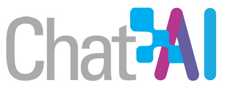

```{r setup, include=FALSE}
options(htmltools.dir.version = FALSE)
knitr::opts_chunk$set(warning = FALSE, message = FALSE, 
  comment = NA, dpi = 300,
  fig.align = "center", out.width = "70%", cache = FALSE)
library(tidyverse)
library(here)
library(knitr)
#devtools::install_github("hadley/emo")
library(emo)
library(extrafont)
library(png) 
library(xaringan)
library(countdown)

ggplot2::theme_set(theme_minimal())
```


# Mit wem haben Sie es zu tun?

## Ihr Dozent und Übungsleiter

.pull-left[
<br><br>
**Dozent**

Dr. Alexander Rieber

<a href="mailto:alexander.rieber@uni-ulm.de"><i class="fa fa-paper-plane fa-fw"></i>&nbsp; alexander.rieber@uni-ulm.de</a><br>

Büro: Helmholtzstraße 18, Raum 1.22
]

.pull-right[
<br><br>
**Übungsleiter**

Dennis Steinle 

<a href="mailto:dennis.steinle@uni-ulm.de"><i class="fa fa-paper-plane fa-fw"></i>&nbsp; dennis.steinle@uni-ulm.de</a>

Büro: Helmholtzstraße 18, Raum 1.10
]

---

## Ihre Tutoren

.pull-left[

<br><br>
**Tutorin**

Judith Sulz

<a href="mailto:judith.sulz@uni-ulm.de"><i class="fa fa-paper-plane fa-fw"></i>&nbsp; judith.sulz@uni-ulm.de</a>

<br><br>
**Tutor**

Frederick Sollors

<a href="mailto:frederick.sollors@uni-ulm.de"><i class="fa fa-paper-plane fa-fw"></i>&nbsp; frederick.sollors@uni-ulm.de</a>
]

.pull-right[

<br><br>
**Tutorin**

Amy Funk-Duque

<a href="mailto:amy.funk-duque@uni-ulm.de"><i class="fa fa-paper-plane fa-fw"></i>&nbsp; amy.funk-duque@uni-ulm.de</a>

<br><br>
**Tutorin**

Julia Holzwarth

<a href="mailto:julia.holzwarth@uni-ulm.de"><i class="fa fa-paper-plane fa-fw"></i>&nbsp; julia.holzwarth@uni-ulm.de</a>
]

---
class: inverse, center, middle

# Vorlesungsdetails

---

## Aufbau der Veranstaltung

- Interaktive Vorlesung mit Übungsaufgaben
- `RTutor` Übungsaufgaben um Inhalte zu vertiefen
- Ein gemeinsames Projekt mit dem Dozenten
- Zwei selbstständige Projekte
- Peer Review der Projekte

---

## Wo finden Sie die Kursmaterialien?

.center[.instructions[Unserer Kommunikation mit Ihnen erfolgt über unsere Moodle und Github Seite]]

Auf diesen Seiten finden Sie:

--
- Veranstaltungsplanung in [Moodle](https://moodle.uni-ulm.de/course/view.php?id=70782) und als Wochenkalender `r emo::ji("calendar")`

--
- Vorlesungsfolien `r emo::ji("spiral_notepad")`

--
- Lehrvideos `r emo::ji("video")`

--
- RTutor Problem Sets (Übungskurse zum erlernen von R) -> `RTutor`

--
- Aufgabenstellungen für die einzelnen Projekte `r emo::ji("book")`

--
- Tutoriumszeiten und -räume für die Projektteams `r emo::ji("busts_in_silhouette")`

--
- Forum für Fragen `r emo::ji("man_student")` `r emo::ji("woman_student")` `r emo::ji("exclamation_question_mark")`

---

## Interaktive Vorlesung

Bis zum 12. November werden Vorlesungen in Form von **Präsenzveranstaltungen in H3** jeden **Mittwoch von 8:30 - 10:00 Uhr** und **Freitag von 10:15 - 11:45 Uhr** stattfinden. Weiterhin gibt es **Lehrvideos, Tutorials und RTutor Problem Sets**, welche die Vorlesung begleiten.

Am Freitag den 14. November wird eine Projektarbeit innerhalb der Vorlesung mit ihnen gemeinsam erarbeitet. Diese macht 10% der Endnote aus.

.center[.alert[Anschließend gibt es zwei selbstständige Projektarbeiten, welche in die Endnote einfließen werden.]]

--

- Interaktive Vorlesung mit integrierten Übungsaufgaben
- Geblockte Vorlesungseinheiten zu Beginn des Semesters
- Vorlesungen dienen der praktischen Anwendung aus den Lehrvideos
  - Hier wird eine Case-Study systematisch behandelt
- RTutor Problem Sets und Tutorials sollen zum "learning-by-doing" anregen
- Alle Vorlesungs- und Übungsunterlagen werden auf Moodle bereitgestellt

---
class: inverse, middle, center

# Was Sie in dieser Vorlesung lernen

---

## Was Sie in dieser Vorlesung lernen

--

- **Programmierung in R**: Sie werden wissen, wie Sie die Statistik-Software R dazu benutzen können um unterschiedlichste Fragestellungen zu beantworten

--
- **Datenbearbeitung**: Sie werden mit unterschiedlichsten Datensätzen arbeiten können und verstehen, diese aufzuarbeiten und zu visualisieren

--
- **Reproduzierbarkeit**: Sie können die Ergebnisse ihrer Arbeit so kummunizieren, dass Dritte sie nachvollziehen und reproduzieren können 

--
- **AI Literacy**: Sie wissen, wie Sie künstliche Intelligenz als persönlichen Tutor nutzen können

--
- **Präsentationstechniken**: Sie können die Ergebnisse ihrer Arbeit anschaulich und kompakt präsentieren 

--
- **Statistik**: Sie können die Ergebnisse ihrer (Regressions-) Analysen interpretieren

--
- **Kausalität**: Sie können kausale Zusammenhänge aus experimentellen Daten und Beobachtungsdaten ableiten

---


## Was Sie in dieser Vorlesung lernen

- **Programmierung in R**: Sie werden wissen, wie Sie die Statistik-Software R dazu benutzen können um unterschiedlichste Fragestellungen zu beantworten (`r emo::ji("heavy_check_mark")`)
- **Datenbearbeitung**: Sie werden mit unterschiedlichsten Datensätzen arbeiten können und verstehen, diese aufzuarbeiten und zu visualisieren (`r emo::ji("heavy_check_mark")`)
- **Reproduzierbarkeit**: Sie können die Ergebnisse ihrer Arbeit so kummunizieren, dass Dritte sie nachvollziehen und reproduzieren können (`r emo::ji("heavy_check_mark")`)
- **AI Literacy**: Sie wissen, wie Sie künstliche Intelligenz als persönlichen Tutor nutzen können (`r emo::ji("heavy_check_mark")`)
- **Präsentationstechniken**: Sie können die Ergebnisse ihrer Arbeit anschaulich und kompakt präsentieren (`r emo::ji("heavy_check_mark")`)
- **Statistik**: Sie können die Ergebnisse ihrer (Regressions-) Analysen interpretieren (`r emo::ji("check")`)
- **Kausalität**: Sie können kausale Zusammenhänge aus experimentellen Daten und Beobachtungsdaten ableiten (`r emo::ji("check")`)

.center[.alert[Der Statistikteil wird im zweiten Teil des Kurses, d.h. im Sommersemester 2026, abgedeckt.]]

---

class: inverse, center, middle

# Übungsaufgaben mit `RTutor`

---

## Wie Sie die Vorlesungsinhalte vertiefen

- Wöchentliche `RTutor` Problem Sets, welche die Unterrichtseinheit aufgreifen und vertiefen
- Den Umgang mit R-Markdown erlernen als Vorbereitung für die späteren Projekte
- _Individuelle_ Abgabe der `RTutor` Problem Sets als **Vorleistung** 

--

Die `RTutor` Problem Sets behandeln vorlesungsbegleitend folgende Inhalte:

- Einführung in R
- Datenaufbereitung
- Visualisierung von Daten

.instructions[Bearbeitung der RTutor Problem Sets **lokal oder** in der **Posit Cloud** möglich.]

---

class: inverse, center, middle

# Unterstützungsangebote

---

## Wo bekommen Sie Hilfe?

- Auf Moodle gibt es ein Diskussionsforum, scheuen Sie sich nicht dort ihre Fragen zu stellen!
    - Bitte benutzen Sie dieses Forum, bevor Sie eine Mail an den Tutor, Übungsleiter oder Dozent stellen
    - Wir haben einige Beispiele aufgearbeitet, wie Sie Fragen stellen sollten, damit Sie schnell eine Antworten erhalten. Das Dokument finden Sie in Moodle unter [`Wie stelle ich Fragen im Forum?`](https://projektkurs-data-science-ulm2526.netlify.app/tutorials/fragen-im-forum)
--
- Es finden parallel zu den Projektarbeiten Tutorien statt, wobei jede Gruppe einen festen Termin pro Woche erhält

--
- Für Fragen zur Notengebung oder persönliche Fragen können Sie dem Dozenten eine E-Mail schicken

---

## Tutorium

- Bereits ab der 1. Vorlesungswoche gibt es ein vorlesungsbegleitendes Tutorium.
- Die Tutorien werden während der Projektphase wöchentlich **online** stattfinden (für jede/n Tutor*in gibt es eigene Zoom-Räume mit Break-out Räumen pro Gruppe)
- Die Tutor*innen beantworten auch Fragen auf Moodle
  - Bitte stellen Sie ihre Fragen im Forum, wenn ihr Problem allgemeiner Natur ist

--

.instructions[Das Tutorium soll hauptsächlich dazu dienen Sie bei ihren individuellen Projektausarbeitungen zu unterstützen!]

---

## Tutorium

Der **erste Tutoriumstermin** ist am **16.10.2025** von **14 - 18 Uhr** ( **online** )

- In diesem Tutorium werden technische Probleme geklärt
- Bitte beachten Sie alle Hinweise in den Videos und die schriftlichen Ausführungen zur Installation von R und RStudio, Github Account erstellen etc.

--

Die **erste Vorlesung** ist am **17.10.2025** von **10:15 - 11:45 Uhr** ( in **H3** ) 

--

.instructions[Es ist sehr wichtig, dass jeder die [neueste Version von R (Version 4.5.1)](https://www.r-project.org/) und [RStudio (Version 2025.09.1-401)](https://posit.co/download/rstudio-desktop/) installiert hat und ein Konto bei [GitHub](https://github.com/) erstellt hat, da die späteren Projekte darüber durchgeführt werden.]

.alert[Bitte schauen Sie sich die Videos zur Installation von R, RStudio und Github an!]

---

## Mögliche LLMs zur Nutzung

.pull-left[
```{r, echo=F}

```
]

.pull-right[
Sie können den datenschutzrecht-konformen Zugang zu Chat AI nutzen, ein Angebot der [GWDG](https://kisski.gwdg.de/en/leistungen/2-02-llm-service/) (Kostenlose Registrierung und Nutzung mit ihrem Uni-Account)

Von der GWDG gehostete Open Source Modelle (Qwen, Deepseek, OpenAI GPT OSS, LLama,...)

**Vorteil für Sie:** Sie erhalten einen datenschutzrechtlich sicheren Zugriff auf diverse LLMs

- Integration von LLMs in den Lernprozess
- Nutzung von LLMs in der Vorlesung und in den Projekten
- Kennenlernen von LLMs im akademischen Kontext (Ethik und rechtliche Einschränkungen)
]

---

## Alternative: Google Gemini für Studierende

.pull-left[
```{r, echo=F}

```
]

.pull-right[
Zugriff auf Google's Gemini Pro Modell über einen Studierendenaccount.

Anmeldung bis 3. November möglich um einen Zugriff für 1 Jahr kostenlos zu erhalten: https://one.google.com/intl/de_de/about/articles/google-ai-for-students/

Vorteile:

- Sehr leistungsstarkes LLM
- Nicht nur Zugriff auf Gemini, sondern auch auf weitere Google Dienste
- Kein Kosten (das 1. Jahr) -> **Aber:** Sie müssen selbstständig daran denken das Abo wieder zu kündigen!
]

---
class: inverse, center, middle

# Mit welchen Daten bekommen _Sie_ es zu tun?

---

### Case-Study: Verschuldung in Deutschland

--

.pull-left[
<br><br>
In der Case-Study widmen Sie sich der Frage:

.alert[Gibt es einen Zusammenhang zwischen der Verschuldung eines Landkreises und dessen Arbeitslosenquote?]

Zur Beantwortung dieser Frage werten Sie u.a. Informationen vom statistischen Bundesamt auf Landkreisebene aus.
]
.pull-right[
<br><br>
```{r, echo=FALSE, out.width="90%"}
verschuldung <- "figs/verschuldung.png"
include_graphics(verschuldung)
```
]

---


### Projekt 1: Betrugserkennung im Unternehmen

--

.pull-left[
<br><br>
In diesem Projekt widmen Sie sich der Frage:

.alert[Wie kann ein/e Wirtschaftsprüfer/in mögliche Bilanzmanipulationen aufspüren?]

Zur Beantwortung dieser Frage werten Sie Informationen von Journalbuchungen aus.
]
.pull-right[
<br><br>
```{r, echo=FALSE, out.width="110%"}
buchung <- "figs/Buchungen_wochentag.png"
include_graphics(buchung)
```
]

---

### Projekt 2: Ökonomische Analyse der deutschen Land- und Forstwirtschaft

--

.pull-left[
<br><br>
In diesem Projekt widmen Sie sich der Frage: 

.alert[Wie setzen sich die EU-Subventionen für Land- und Forstwirtschaft zusammen und welche Kosten entstehen, insbesondere in der Forstwirtschaft?]

Zur Beantwortung dieser Frage nutzen Sie aktuellen Daten des Bundesministeriums für Ernährung und Landwirtschaft, der EU und statistischer Ämter 
]
.pull-right[
<br><br>
```{r, echo=FALSE, out.width="60%"}
waldbrand <- "figs/Waldbrand.png"
include_graphics(waldbrand)
```

<font size="1">Quelle: https://www.wa.de/deutschland/werden-waldbrandgefahr-in-deutschland-spitzt-sich-zu-hitze-und-trockenheit-koennen-jetzt-lebensgefaehrlich-zr-93814872.html</font> 
]

---

### Projekt 3: Die Deutsche Bahn - Eine Analyse von Nah- und Fernverkehr

--

.pull-left[
<br><br>
In diesem Projekt widmen Sie sich der Frage:

.alert[Was sind die Treiber der Verspätung im Nah- und Fernverkehr der deutschen Bahn?]

Zur Beantwortung dieser Fragen analysieren sie Daten zum Nah- und Fernverkehr der deutschen Bahn für die 100 größten deutschen Bahnhöfe.
]
.pull-right[
<br><br>
```{r, echo = FALSE, out.width="70%"}
db <- "figs/db.webp"
include_graphics(db)
```

]

---

## Was Sie in den Projekten lernen

- Analysen auf **echten Daten**

--
- Download und zusammenfügen eigener Datensätze

--
- Deskriptive Analysen und Grafiken

--
- Beschreibung der Analysen

--
- **Im Sommersemester 2026**: Statistische Auswertungen

---

## Was Sie durch Review Reports lernen

.alert[Nach dem zweiten und dritten Projekt wird ihnen die Ausarbeitung einer anderen Gruppe zur Einschätzung zugespielt.]

--

.question[Warum machen wir das?]

--
- Rekapitulation des Projekts

--
- Kritische Auseinandersetzung mit der Arbeit von Mitstudierenden

--
- Erkennen was die andere Gruppe gut/schlecht gemacht hat und was Sie daraus für ihre eigene Arbeit mitnehmen können

--
- Automatisch: Vorbereitung auf die Klausur

--

.instructions[Die Review Reports für jedes Projekt sind _individuelle_ Abgaben!]

---
class: inverse, center, middle

# Wie setzt sich die Note zusammen?

---

## Notengebung

Nach den Vorlesungseinheiten und der Einführung in R gibt es drei Projekte:

- Erstes Projekt: Zusammen mit dem Dozenten: 10 Punkte = 10% der Note

--
- Zweites Projekt: 30 Punkte = 30% der Note

--
- Drittes Projekt: 30 Punkte = 30% der Note

--
- Multiple-Choice Abschlussprüfung: 30 Punkte = 30% der Note

--

Es werden immer **Gruppen von drei Personen** geformt, welche die **Projekte zusammen** abgeben.
Natürlich dürfen alle Teilnehmer Projekte gerne miteinander diskutieren. 

**Jedoch** muss jede Gruppe eine _individuelle Ausarbeitung_ abgeben. 
Wenn sich die Lösung einzelner Abschnitte der Projektes (oder das komplette Projekt) zu stark ähnelt, wird dies mit 0 Punkten für das Projekt geahndet (für alle beteiligten Gruppen).

---

## Vorleistungen

**Vorleistung 1:** Die **RTutor Problem Sets** müssen **individuell** bearbeitet und eingereicht werden um für die Projekte und Klausur zugelassen zu werden
  - Letztes RTutor Problem Set ist am 03. November 2025 fällig
  - Mindestens **80% der Punkte pro Problem Set** müssen erreicht werden um für die Projekte zugelassen zu werden

--

**Vorleistung 2 a):** Am 21. November 2025 findet eine (multiple-choice) **Probeklausur** statt um ihnen ein Gefühl für die Klausur am Ende des Semesters zu geben (30 Fragen). Es müssen **mind. 20% der Punkte** erreicht werden um die Vorleistung zu erhalten. Um die Klausurbedingungen zu simulieren sind keine Hilfsmittel erlaubt.

--

**Vorleistung 2 b):** Die **Peer Reviews** müssen **individuell** bearbeitet und eingereicht werden um für die Klausur zugelassen zu werden
  - Studenten ranken die Review Reports nach Nützlichkeit:
    - Bei _mindestens_ einem Projekt muss der Review Report _mindestens_ auf Platz 2 gerankt werden. 
    - Wenn alle Reports als "nützlich" eingestuft wurden, entscheidet der Dozent über die Zulassung zu Klausur

--

.alert[Die Multiple-Choice-Abschlussprüfung beinhaltet Fragen zu den drei Teilprojekten, den Vorlesungsinhalten, der Case-Study und den `RTutor` Problem Sets.]

---

class: inverse, center, middle

# Wir möchten den Projektkurs weiterentwickeln

---

## Begleitstudie

Wir haben auf Basis des Feedbacks der letzten Jahre einige Änderungen am Projektkurs vorgenommen und möchten die Veranstaltung kontinuierlich weiterentwickeln und sind hierfür auf ihre Hilfe angewiesen.

--

Daher haben wir zu dieser Veranstaltung eine wissenschaftliche Begleitstudie gestartet um den Projektkurs zu verbessern.

- Analyse der Elemente im Projektkurs
  - Github Commits
  - Vorleistung und Prüfungsergebnisse
  - Subjektive Einschätzung zu den Projekten
- Pseudonymisierung der Daten
  - Keine Rückschlüsse auf einzelne Personen möglich!

.alert[Hierfür haben wir eine **Einverständniserklärung und Datenschutzerklärung vorbereitet** und bitten Sie diese anzuschauen. Falls wir ihre Daten für die Begleitstudie verwenden dürfen, so geben Sie dies bitte im Formular auf Moodle entsprechend an.]

---

.instructions[Bitte lesen Sie die **Einverständniserklärung und Datenschutzerklärung** durch und geben Sie im Moodle Kurs an, ob Sie damit einverstanden sind, oder nicht.]

```{r, echo=FALSE}
countdown(minutes = 10)
```


---

## LLMs im Projektkurs

- Sie können für diese Vorlesung und insbesondere die späteren Projekte, jegliche Form von LLM Unterstützung nutzen. 
- Wir werden unterschiedliche LLMs in der Vorlesung einsetzen
- Für den Einsatz in den Projekten haben wir eine [KI-Guideline](https://projektkurs-data-science-ulm2526.netlify.app/tutorials/quellenverweise-und-ai-policy) erarbeitet, welche auch die Sichtweise der Uni Ulm widerspiegeln
- Sie sollten die LLMs als Tool sehen: Eine Tutorin, welche 24/7 für Sie erreichbar ist und nicht müde wird ihre Fragen zu beantworten
    
.alert[Die KI ersetzt nicht selbst zu denken! Gerade das kritische Denken ist wichtig bei der Arbeit mit LLMs. Sie sind immer verantwortlich für das, was Sie einreichen.]

---

## Notengebung der Projekte

- Im zweiten Projekt muss neben der schriftlichen Ausarbeitung (70% der Note für das Projekt) auch ein Screencast (30% der Note für das Projekt) gehalten werden
    - Der Screencast sollte nicht länger als 5 Minuten gehen
--
- Im dritten Projekt muss neben der schriftlichen Ausarbeitung (70% der Note für das Projekt) auch ein Screencast (30% der Note für das Projekt) gehalten werden
    - Der Screencast sollte nicht länger als 5 Minuten gehen

--

.instructions[Bitte bereiten Sie den Screencast frühzeitig vor, er gibt 30% der Note!]

---

## Teilen von Code

- Viel ist im Web verfügbar und darf auch gerne verwendet werden
    - Wenn Sie Code aus dem Internet verwenden, dann müssen Sie die Quelle entsprechend kennzeichnen!
    - Falls Sie die Quelle nicht zitieren wird dies als Plagiat gewertet und wird mit einer 5.0 für das gesamte Projekt geahndet
- `RTutor` Problem Sets sind selbstständig auszuführen. Code darf nicht mit anderen geteilt werden!

--

.instructions[Projekte dürfen innerhalb der Gruppe und auch gerne mit anderen Gruppen diskutiert werden, jedoch darf kein Code an andere Gruppen weitergegeben werden!]

---

## Zeitmanagement    

- Definieren Sie Meilensteine
    - Bis wann muss was von wem erstellt worden sein?

--

- Bleiben Sie in Kontakt mit ihrem/ihrer Gruppenpartner*in, bspw. über Github/Whatsapp oder sonstige Kanäle, um über ihren Projektfortschritt zu sprechen
--

- Stellen Sie unbedingt Fragen im Forum auf Moodle!
    - Hier können Fragen oft sehr schnell beantwortet werden und meist haben mehrere Gruppen die gleiche Frage
    - Wenn Sie die Antwort auf eine Frage wissen, dann scheuen Sie sich nicht diese in Moodle zu posten!

--

- Nutzen Sie die Möglichkeit des Tutoriums und sprechen Sie dort Schwierigkeiten direkt an
--

- Kommen Sie bei tiefergehenden Fragen frühzeitig auf den Übungsleiter und Dozenten zu
--

- Planen Sie genügend Zeit für die Erstellung und das Halten des Screencast ein
  - Der Screencast gibt 30% der Projektnote -> Nicht auf die leichte Schulter nehmen!

---

## Vorbereitung bis zum Tutorium bzw. der Vorlesung am Freitag

.center[.alert[**Wir haben für alle diese Bereiche Lehrvideos erstellt**]]

---

## Vorbereitung bis zum Tutorium bzw. der Vorlesung am Freitag

- Laden Sie R und RStudio herunter
    - Nutzen Sie hierfür das Tutorial auf unserer Moodle Seite
    - _Bitte beachten Sie_: 
        - Installieren Sie die [neueste Version von R (Version 4.5.1)](https://www.r-project.org/) und [RStudio (Version 2025.09.1-401)](https://posit.co/download/rstudio-desktop/)
        - Wenn Sie bereits R und R-Studio installiert haben stellen Sie sicher, dass diese auf dem neuesten Stand sind (hier hilft ihnen das Paket `installr` mit der Funktion `updateR()`)
        - Sie können die Version von R über die Eingabe des Befehls `version` prüfen
        - Sie können die Version von R-Studio über die Eingabe des Befehls `RStudio.Version()` prüfen
        - Installieren Sie die Pakete `tidyverse` und `RTutor`
        - Stellen Sie sicher, dass ihre Pakete unter der neuesten Version von R funktionieren (hier hilft der Befehl `update.packages()`)

---

## Erstellen eines Github Accounts

.instructions[
Gehen Sie auf [github.com](https://github.com/) und erstellen Sie sich einen Account (falls Sie noch keinen haben). 
]

Tipps zum Nutzernamen:<sup>✦</sup>

.midi[
- Nehmen Sie ihren richtigen Namen auf
- Wählen Sie **keinen fiktiven Namen**, welcher schwer zu finden ist.
- Kurz und prägnent
- Keine Info über die aktuelle Uni o.ä.
]

.footnote[ 
<sup>✦</sup> Source: [Happy git with R](http://happygitwithr.com/github-acct.html#username-advice) von Jenny Bryan
]

---

## Geben Sie ihren Github Namen in Moodle an

Abfrage in Moodle:
  - Github Name
  - E-Mail Adresse ihres Github-Kontos (wir empfehlen hier die **Uni-Ulm E-Mail-Adresse zu verwenden**)
    - Wenn Sie die Uni Ulm Adresse verwenden können Sie [zusätzliche Vorteile beantragen](https://education.github.com/discount_requests/application)
    - Melden Sie sich im Hochschuldiensteportal für die Projekte an (Prüfungsnummer 16043)
  
---

## Erstellen Sie einen Account bei Posit Cloud

.instructions[
Gehen Sie auf [Posit-Cloud](https://posit.cloud/) und loggen sich mit ihrem Github Account ein
]

---

## Erste Schritte mit der KI

Registrieren Sie einen Account bei [GWDG](https://kisski.gwdg.de/en/leistungen/2-02-llm-service/) und/oder [Google Gemini]( https://one.google.com/intl/de_de/about/articles/google-ai-for-students/)

Fragen Sie die KI (Sie können unterschiedliche LLMs auswählen, machen Sie das bitte mal):

- 10 unterschiedliche, nicht miteinander zusammenhängende Fragen zu unterschiedlichen Themen in denen Sie sich auskennen
- Bewerten Sie die Antworten der LLMs auf einer Skala von 1-10 (1 = nutzlos, 10 = perfekt)
- Schauen Sie sich den Stil und die Form der Antworten an, die Sie erhalten haben. Fällt ihnen etwas auf? Sind Sie damit zufrieden?